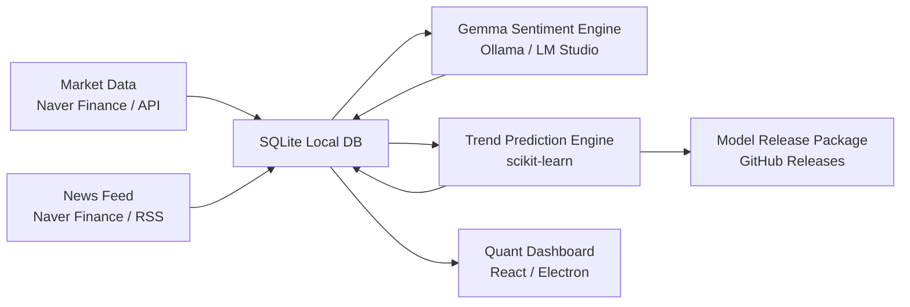

# Omniscient AI Quant System

> Local-first AI quant dashboard for Korean equities.  
> KOSPI/KOSDAQ 데이터 수집, 로컬 LLM 감성 분석, 경량 예측 모델, 그리고 배포 가능한 데스크톱 앱을 목표로 하는 독립형 퀀트 시스템입니다.


## Overview

Omniscient AI Quant System은 로컬 PC에서 한국 주식 데이터를 수집하고, 뉴스 감성을 분석하며, 가격/거래량 기반의 방향성 예측을 수행하는 AI 퀀트 대시보드 프로젝트입니다.

다른 PC나 Codex 작업공간에서 이어받을 때는 먼저 [`PROJECT_HANDOFF.md`](PROJECT_HANDOFF.md)를 확인하십시오. 전체 목표, 진행 타임라인, 로컬 DB 주의사항, 다음 작업 순서가 정리되어 있습니다.

이 프로젝트의 핵심 원칙은 명확합니다.

- 데이터와 모델은 가능한 한 로컬에서 관리합니다.
- Gemma는 파인튜닝하지 않고, 뉴스 감성 분석용 추론 엔진으로 사용합니다.
- 주가 예측은 GPU 의존도를 낮춘 경량 머신러닝 모델로 처리합니다.
- 최종 사용자는 명령어를 입력하지 않고 EXE 앱을 실행하는 방식으로 사용합니다.

> 이 프로젝트는 연구 및 개발 목적의 소프트웨어입니다. 투자 조언이나 수익 보장을 제공하지 않습니다.

## Architecture



## Current Capabilities

| Area | Status | Description |
| --- | --- | --- |
| Market Collection | Implemented | KRX 종목 현재가, 거래량, KOSPI/KOSDAQ 지수 수집 |
| News Collection | Implemented | 네이버 금융 뉴스 수집 및 SQLite 저장 |
| Universe Refresh | Implemented | KOSPI/KOSDAQ 전체 종목 유니버스 갱신 |
| Historical Backfill | Implemented | 대표 표본 백필 및 검색 종목 온디맨드 백필 |
| Sentiment Analysis | Implemented | Ollama/LM Studio 기반 Gemma 감성 분석 |
| Trend Prediction | Implemented | OHLCV, 변동성, 거래량, 감성 점수 기반 경량 예측 |
| Model Packaging | Implemented | 학습 모델, 메타데이터, manifest ZIP 패키징 |
| Dashboard UI | Planned | 실시간 차트, 뉴스, 예측 궤적, 투자 의견 화면 |
| EXE Packaging | Planned | 최종 사용자를 위한 데스크톱 앱 배포 |

## Project Structure

```text
.
├── phase1_collector.py       # 실시간 가격, 지수, 뉴스 수집
├── stock_universe.py         # KOSPI/KOSDAQ 종목 유니버스 갱신
├── historical_backfill.py    # 과거 일봉 OHLCV 백필
├── backfill_status.py        # 백필 진행률 확인
├── sentiment_analyzer.py     # Gemma 기반 뉴스 감성 분석
├── trend_predictor.py        # 경량 주가 방향성 예측 모델
├── model_release.py          # 모델 릴리즈 ZIP 생성
├── config.yaml               # 시스템 설정
├── requirements.txt          # Python 의존성
├── data/                     # SQLite DB 저장 위치
├── logs/                     # 실행 로그
└── models/                   # 학습 모델 및 릴리즈 패키지
```

## Quick Start

### 1. Install Dependencies

```powershell
python -m pip install -r requirements.txt
```

### 2. Run One Collection Cycle

```powershell
python phase1_collector.py --once --config config.yaml
```

### 3. Run Continuous Collection

```powershell
python phase1_collector.py --config config.yaml
```

기본 설정은 가격 데이터를 60초마다, 뉴스 데이터를 600초마다 수집합니다.

## Historical Data Strategy

전체 KRX 종목의 모든 과거 데이터를 한 번에 크롤링하지 않습니다. 차단 위험과 실행 시간을 줄이기 위해 다음 전략을 사용합니다.

1. 초기 학습에는 대표 표본 300개 종목을 사용합니다.
2. 각 종목은 기본 100페이지, 약 1,000개 일봉을 수집합니다.
3. 사용자가 앱에서 특정 종목을 검색하면 해당 종목만 온디맨드로 추가 백필합니다.
4. 완료된 종목은 SQLite 상태 테이블에 기록되어 재실행 시 자동으로 건너뜁니다.

### Refresh Stock Universe

```powershell
python stock_universe.py --config config.yaml
```

### Backfill Training Sample

```powershell
python historical_backfill.py --all-symbols --training-sample --config config.yaml
```

장시간 실행 시에는 제한 시간을 두고 반복 실행할 수 있습니다.

```powershell
python historical_backfill.py --all-symbols --training-sample --config config.yaml --max-runtime-seconds 28800
```

### Watch Backfill Progress

```powershell
python backfill_status.py --config config.yaml --watch 10
```

### On-Demand Backfill

최종 앱에서는 사용자가 종목을 검색했을 때 이 흐름을 내부적으로 실행합니다.

```powershell
python historical_backfill.py --symbol 005930 --on-demand --config config.yaml
```

## Local Gemma Sentiment Engine

RTX 3070 8GB 기준 권장 모델은 `gemma4:e2b`입니다. 더 큰 모델은 VRAM 초과 가능성이 있습니다.

```powershell
ollama pull gemma4:e2b
ollama run gemma4:e2b
```

뉴스 감성 분석 1회 실행:

```powershell
python sentiment_analyzer.py --once --config config.yaml
```

스케줄러 실행:

```powershell
python sentiment_analyzer.py --config config.yaml
```

분석 결과는 SQLite의 뉴스 테이블에 저장됩니다.

- `sentiment_score`
- `ai_summary`
- `event_tags`
- `analyzed_at`
- `llm_model`

## Trend Prediction

현재 예측 엔진은 CPU 친화적인 scikit-learn 모델을 사용합니다. 입력 feature는 다음 데이터를 결합합니다.

- 가격 수익률
- 이동평균 대비 괴리
- 거래량 변화
- 고가/저가 변동폭
- 5일 변동성
- 시장 구분
- 뉴스 감성 평균 및 개수

### Train Model

```powershell
python trend_predictor.py --train --config config.yaml
```

### Predict Latest Symbols

```powershell
python trend_predictor.py --predict --config config.yaml
```

### Run Background Trainer

```powershell
python trend_predictor.py --daemon --config config.yaml
```

## Model Release Package

학습된 모델은 GitHub Release에 업로드 가능한 ZIP 패키지로 만들 수 있습니다.

```powershell
python model_release.py --config config.yaml
```

생성 위치:

```text
models/releases/
```

패키지 구성:

- `predictor_latest.joblib`
- `metadata.json`
- `manifest.json`

`manifest.json`에는 모델 버전, feature schema, 학습 row 수, 성능 지표, SHA256 해시가 포함됩니다.

## Configuration

주요 설정은 `config.yaml`에서 관리합니다.

| Section | Description |
| --- | --- |
| `database` | SQLite DB 경로 |
| `collection` | 가격/뉴스 수집 주기와 요청 설정 |
| `stocks` | 기본 추적 종목 |
| `indices` | KOSPI/KOSDAQ 지수 설정 |
| `llm` | Ollama 또는 LM Studio 연결 정보 |
| `sentiment` | 감성 분석 배치 설정 |
| `prediction` | 예측 모델 경로와 학습 설정 |
| `historical` | 표본/온디맨드 백필 설정 |
| `universe` | KOSPI/KOSDAQ 유니버스 갱신 설정 |

## API Keys

현재 Naver Finance 기반 수집에는 API 키가 필요하지 않습니다.

향후 한국투자증권 Open API를 붙일 경우 다음 값이 필요합니다.

- `KIS_APP_KEY`
- `KIS_APP_SECRET`
- 계좌 및 상품 설정

## Roadmap

### Phase 1. Data Foundation

- 실시간 가격/거래량 수집
- 뉴스 수집
- 지수 수집
- SQLite 저장
- 표본 백필 및 온디맨드 백필

### Phase 2. Local AI Analysis

- Gemma 기반 뉴스 감성 분석
- 종목별 뉴스 요약
- 감성 점수와 이벤트 태그 저장

### Phase 3. Prediction Engine

- 가격/거래량 기반 방향성 예측
- 감성 점수 feature 결합
- 모델 패키징 및 버전 관리

### Phase 4. Dashboard

- 종목 검색
- 실시간 캔들 차트
- 예측 궤적 표시
- 뉴스 배너와 감성 점수
- AI 투자 의견 패널

### Phase 5. Desktop Release

- FastAPI 백엔드 자동 실행
- Electron 기반 데스크톱 앱
- 모델 업데이트 다운로드
- GitHub Releases 기반 배포

## Final App Direction

개발 중에는 명령어로 각 모듈을 검증합니다. 하지만 최종 앱에서는 사용자가 명령어를 입력하지 않습니다.

최종 목표는 다음과 같습니다.

1. 사용자가 EXE를 실행합니다.
2. 앱이 로컬 DB와 백엔드를 자동으로 시작합니다.
3. 필요한 모델을 GitHub Release에서 확인하고 업데이트합니다.
4. 사용자가 종목을 검색하면 부족한 과거 데이터를 온디맨드로 채웁니다.
5. 대시보드는 가격, 뉴스, 감성, 예측을 하나의 화면에 표시합니다.

## Disclaimer

본 프로젝트는 자동화된 데이터 분석 및 연구를 위한 소프트웨어입니다. 제공되는 예측, 감성 점수, 투자 의견은 참고용이며 실제 투자 판단의 근거로 단독 사용해서는 안 됩니다.
